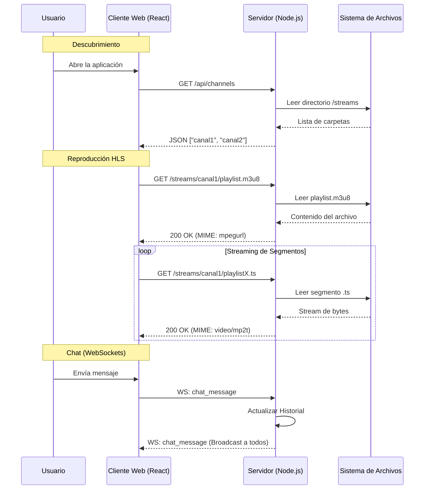
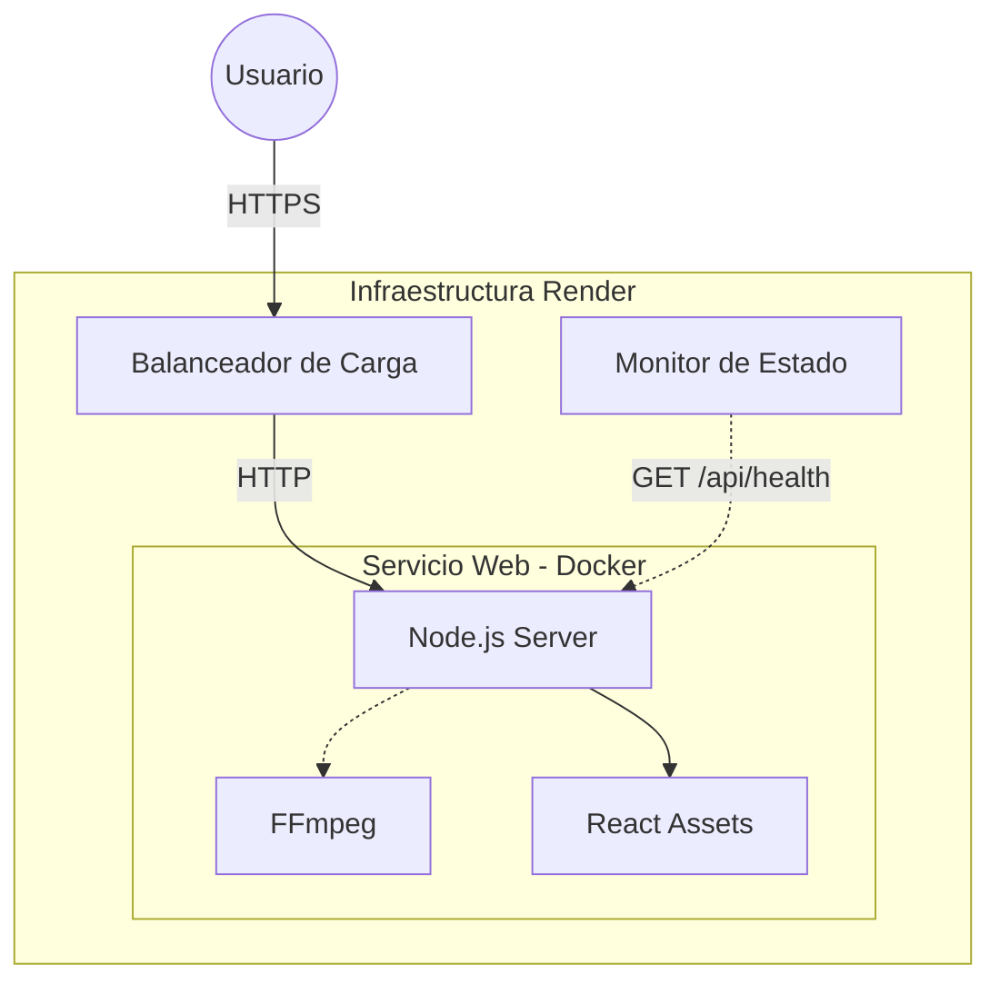

# Memoria Técnica: Sistema de Streaming IPTV HLS con Arquitectura de Microservicios

**Autor:** Omar Cornejo  
**Fecha:** 30 de Noviembre de 2025  
**Proyecto:** prac5 - Servidor IPTV HLS  
**Versión del Documento:** 2.0 (Extendida)

---

## Resumen Ejecutivo

Este documento detalla el diseño, implementación y despliegue de una plataforma de streaming de video bajo demanda (VOD) basada en el protocolo HLS (HTTP Live Streaming). El sistema, desarrollado como parte de la práctica 5, integra un backend en Node.js para la gestión de contenidos y señalización en tiempo real, y un frontend moderno en React que emula la experiencia de usuario de aplicaciones de "scroll infinito" como TikTok o Instagram Reels. La infraestructura se ha contenerizado utilizando Docker para garantizar la portabilidad y se ha desplegado en la plataforma Render.com.

---

## Índice de Contenidos

1.  [Introducción](#1-introducción)
    *   1.1 Contexto Tecnológico
    *   1.2 Definición del Problema
    *   1.3 Objetivos del Proyecto
    *   1.4 Alcance y Limitaciones
2.  [Marco Teórico y Estado del Arte](#2-marco-teórico-y-estado-del-arte)
    *   2.1 Fundamentos de Video Digital
    *   2.2 Protocolos de Streaming: La Revolución HTTP
    *   2.3 El Estándar HLS (HTTP Live Streaming)
    *   2.4 Arquitecturas Web Modernas (SPA y Microservicios)
3.  [Análisis y Diseño del Sistema](#3-análisis-y-diseño-del-sistema)
    *   3.1 Requisitos del Sistema
    *   3.2 Arquitectura de Software
    *   3.3 Diagramas de Secuencia
    *   3.4 Modelo de Datos
4.  [Implementación del Backend](#4-implementación-del-backend)
    *   4.1 Servidor HTTP con Express
    *   4.2 Comunicación en Tiempo Real con Socket.IO
    *   4.3 Gestión de Archivos Estáticos y CORS
5.  [Implementación del Frontend](#5-implementación-del-frontend)
    *   5.1 Estructura del Proyecto React
    *   5.2 Integración de Video.js
    *   5.3 Lógica de Interfaz (ReelsView)
6.  [Ingeniería de Video y Transcodificación](#6-ingeniería-de-video-y-transcodificación)
    *   6.1 Automatización con FFmpeg
    *   6.2 Perfiles de Transcodificación
    *   6.3 Análisis de Segmentación
7.  [Infraestructura y DevOps](#7-infraestructura-y-devops)
    *   7.1 Contenerización con Docker
    *   7.2 Optimización de Imágenes (Multi-stage Builds)
    *   7.3 Despliegue en Render
8.  [Manual de Usuario](#8-manual-de-usuario)
9.  [Manual de Desarrollador](#9-manual-de-desarrollador)
10. [Conclusiones](#10-conclusiones)

---

## 1. Introducción

### 1.1. Contexto Tecnológico
La industria del entretenimiento ha sufrido una transformación radical en la última década. El modelo tradicional de radiodifusión (broadcast) ha sido casi totalmente suplantado por el modelo unicast sobre IP. Servicios como Netflix, YouTube, Twitch y TikTok dominan el tráfico global de internet. Según informes de Cisco, el video representa más del 80% del tráfico total de internet en 2023.

Este cambio de paradigma presenta desafíos técnicos inmensos. Transmitir video de alta definición a millones de usuarios simultáneos, con diferentes anchos de banda y dispositivos, requiere una ingeniería sofisticada que va más allá de simplemente "poner un archivo MP4 en un servidor web".

### 1.2. Definición del Problema
El desarrollo de una plataforma de video propia implica resolver tres problemas fundamentales:
1.  **Compatibilidad:** ¿Cómo asegurar que el video se vea en un iPhone, un Android, una Smart TV y un navegador de escritorio sin instalar plugins?
2.  **Adaptabilidad:** ¿Cómo evitar que el video se detenga (buffering) si la conexión del usuario cae de 100 Mbps a 3G?
3.  **Interactividad:** ¿Cómo integrar elementos sociales (chat, likes) sincronizados con la reproducción?

### 1.3. Objetivos del Proyecto
El objetivo general es construir un **Sistema de IPTV (Internet Protocol Television)** funcional que demuestre la viabilidad técnica de una plataforma de streaming moderna utilizando tecnologías de código abierto.

**Objetivos Específicos:**
*   **OE-1:** Diseñar un pipeline de procesamiento de video que convierta archivos crudos en streams HLS compatibles con el estándar ISO/IEC 23009.
*   **OE-2:** Implementar un servidor backend ligero y eficiente en Node.js capaz de servir miles de peticiones de segmentos de video por segundo.
*   **OE-3:** Desarrollar una interfaz de usuario (Frontend) reactiva que implemente el patrón de diseño "Infinite Scroll" para la navegación de contenidos.
*   **OE-4:** Integrar un sistema de chat en tiempo real utilizando WebSockets para fomentar la interacción entre usuarios.
*   **OE-5:** Empaquetar la solución en contenedores Docker para facilitar su despliegue en cualquier proveedor de nube (Cloud Agnostic).

### 1.4. Alcance y Limitaciones
El proyecto abarca desde la ingestión del video (archivo local) hasta su reproducción en el cliente.
*   **Alcance:** Servidor, Cliente Web, Scripts de Transcodificación, Configuración de Despliegue.
*   **Limitaciones:** No se implementa un sistema de autenticación de usuarios (Login) ni una base de datos persistente (SQL/NoSQL) para simplificar la arquitectura y centrarse en el streaming. El almacenamiento es efímero o basado en sistema de archivos local.

---

## 2. Marco Teórico y Estado del Arte

### 2.1. Fundamentos de Video Digital
Para entender el sistema, primero debemos definir qué es un video digital.
*   **Contenedor (Container):** Es el formato del archivo (ej. `.mp4`, `.mkv`, `.avi`). Actúa como una caja que guarda los flujos de video, audio, subtítulos y metadatos.
*   **Códec (Coder-Decoder):** Es el algoritmo que comprime y descomprime la información. El video crudo es inmensamente grande (gigabytes por minuto). Los códecs como H.264 (AVC) o H.265 (HEVC) reducen este tamaño eliminando redundancia espacial (dentro de un cuadro) y temporal (entre cuadros).

### 2.2. Protocolos de Streaming: La Revolución HTTP
Antiguamente, se usaban protocolos como **RTSP (Real-Time Streaming Protocol)** sobre UDP. Eran rápidos pero problemáticos: los firewalls corporativos bloqueaban los puertos UDP no estándar y no se podían usar las cachés web (CDNs) existentes.

La industria migró a **HTTP Streaming**. La idea es simple: trocear el video en miles de archivos pequeños y descargarlos como si fueran imágenes o páginas web normales.
*   **Ventajas:** Atraviesa cualquier firewall (usa puerto 80/443), usa infraestructura HTTP existente, es fácil de escalar.
*   **Desventajas:** Mayor latencia (retraso) comparado con UDP.

### 2.3. El Estándar HLS (HTTP Live Streaming)
Propuesto por Apple en 2009, HLS se ha convertido en el estándar *de facto*.
Funciona mediante dos tipos de archivos:
1.  **Playlist (.m3u8):** Un archivo de texto simple que actúa como índice. Dice: "El video empieza con el archivo `segment0.ts`, luego `segment1.ts`, etc.".
2.  **Segmentos (.ts):** Fragmentos de video de corta duración (ej. 6 segundos) en formato MPEG-2 Transport Stream.

**Adaptive Bitrate (ABR):**
HLS permite tener múltiples calidades. El archivo `.m3u8` maestro lista las variantes (ej. "baja", "media", "alta"). El reproductor descarga el primer segmento de "baja", mide la velocidad de descarga, y si es rápida, pide el segundo segmento de "alta". Esto ocurre dinámicamente.

### 2.4. Arquitecturas Web Modernas
*   **SPA (Single Page Application):** El frontend se carga una sola vez. La navegación no recarga la página, sino que JavaScript reescribe el DOM. Esto es crucial para que el video no se corte al navegar por la app (aunque en nuestro diseño de Reels, cambiamos de video al navegar).
*   **Microservicios:** En lugar de una aplicación monolítica gigante, dividimos el sistema. En este proyecto, aunque el código está en un monorepo, conceptualmente separamos el "Transcodificador" (FFmpeg) del "Servidor Web" (Node.js).

---

## 3. Análisis y Diseño del Sistema

### 3.1. Requisitos del Sistema

**Requisitos Funcionales:**
*   **RF-01:** El sistema debe aceptar archivos de video en formatos comunes (MP4, MOV).
*   **RF-02:** El sistema debe generar automáticamente la lista de reproducción `.m3u8` y los segmentos `.ts`.
*   **RF-03:** El cliente debe permitir pausar, reanudar y silenciar el video.
*   **RF-04:** El cliente debe mostrar una lista de canales disponibles detectados dinámicamente.
*   **RF-05:** Los usuarios deben poder enviar mensajes de texto que aparezcan instantáneamente a otros usuarios conectados.

**Requisitos No Funcionales:**
*   **RNF-01:** La interfaz debe ser "Mobile First", optimizada para pantallas táctiles.
*   **RNF-02:** El servidor debe ser capaz de recuperar la lista de canales sin reiniciar el proceso (Hot Reloading de contenido).
*   **RNF-03:** El despliegue debe ser automatizado mediante un Dockerfile.

### 3.2. Arquitectura de Software

El sistema sigue el patrón **MVC (Modelo-Vista-Controlador)** adaptado a una arquitectura API RESTful.

*   **Modelo:** Representado por el sistema de archivos (carpetas en `/streams`). No hay base de datos relacional; la estructura de carpetas *es* la base de datos.
*   **Vista:** React.js en el cliente. Se encarga de renderizar el HTML y gestionar los eventos del usuario.
*   **Controlador:** Express.js en el servidor. Recibe las peticiones HTTP, valida la entrada y decide qué archivo servir o qué acción ejecutar.

**Diagrama de Flujo de Datos:**

1.  **Ingesta:** Admin ejecuta `npm run convert video.mp4 canal1`.
2.  **Procesamiento:** FFmpeg lee `video.mp4` -> Transcodifica -> Escribe `/streams/canal1/*.ts`.
3.  **Descubrimiento:** Cliente pide `GET /api/channels`. Servidor escanea `/streams` y devuelve `['canal1']`.
4.  **Reproducción:** Cliente pide `/streams/canal1/playlist.m3u8`. Servidor entrega el archivo con MIME `application/vnd.apple.mpegurl`.
5.  **Streaming:** Cliente pide `/streams/canal1/playlist0.ts`. Servidor entrega el segmento.

### 3.3. Diagramas de Secuencia

A continuación se detalla la interacción entre el cliente y el servidor para el flujo de reproducción y chat:



### 3.4. Modelo de Datos (Sistema de Archivos)

La estructura de datos es jerárquica y basada en directorios:

```text
/streams
  ├── /canal_1
  │     ├── playlist.m3u8      (Índice del canal)
  │     ├── playlist0.ts       (Segundos 0-10)
  │     ├── playlist1.ts       (Segundos 10-20)
  │     └── ...
  ├── /canal_2
  │     ├── playlist.m3u8
  │     └── ...
```

Esta decisión de diseño simplifica enormemente el backup y la migración: para mover un canal a otro servidor, solo hay que copiar la carpeta.

---

## 4. Implementación del Backend

El backend es el núcleo del sistema, responsable de orquestar la entrega de contenido y la comunicación en tiempo real. Se ha implementado utilizando **Node.js** y **Express**.

### 4.1. Servidor HTTP con Express (`server.js`)

El archivo `server.js` configura el servidor web. A continuación se analizan sus componentes clave:

**Configuración de CORS:**
```javascript
app.use(cors(config.cors));
```
El Cross-Origin Resource Sharing (CORS) es vital. En desarrollo, el frontend corre en el puerto 3000 y el backend en el 8080. Sin CORS, el navegador bloquearía las peticiones AJAX. En producción, se restringe el origen para mejorar la seguridad.

**Servicio de Archivos HLS (MIME Types):**
```javascript
app.use('/streams', express.static(config.paths.streams, {
  setHeaders: (res, filePath) => {
    if (filePath.endsWith('.m3u8')) {
      res.setHeader('Content-Type', 'application/vnd.apple.mpegurl');
      res.setHeader('Cache-Control', 'no-cache');
    } else if (filePath.endsWith('.ts')) {
      res.setHeader('Content-Type', 'video/mp2t');
    }
  }
}));
```
Esta es la parte más crítica del servidor de streaming.
1.  **`application/vnd.apple.mpegurl`**: Indica al navegador que el archivo es una lista de reproducción HLS. Sin esto, el navegador podría intentar descargarlo como texto.
2.  **`Cache-Control: no-cache`**: Obliga al cliente a verificar siempre si hay una nueva versión de la lista de reproducción. Esto es fundamental en transmisiones en vivo, aunque en VOD es menos crítico, previene problemas de caché obsoleta.
3.  **`video/mp2t`**: El tipo MIME correcto para los segmentos de transporte MPEG-2.

### 4.2. Comunicación en Tiempo Real con Socket.IO

El sistema de chat se implementa sobre WebSockets, que permiten una comunicación bidireccional persistente.

**Gestión de Usuarios:**
```javascript
const users = new Map();
// ...
socket.on('join', (username) => {
  users.set(socket.id, { username, id: socket.id });
  io.emit('user_count', users.size);
  // ...
});
```
Utilizamos un `Map` en memoria para rastrear a los usuarios conectados. Cada vez que alguien se une o desconecta, emitimos el evento `user_count` a *todos* los clientes (`io.emit`), permitiendo mostrar un contador de "Usuarios en línea" en tiempo real.

**Historial de Mensajes:**
```javascript
const messageHistory = [];
// ...
socket.on('chat_message', (data) => {
  // ...
  messageHistory.push(message);
  if (messageHistory.length > 100) messageHistory.shift();
  io.emit('chat_message', message);
});
```
Para que los nuevos usuarios vean el contexto de la conversación, mantenemos un buffer circular de los últimos 100 mensajes en memoria RAM. Cuando un usuario se conecta, recibe este historial inmediatamente.

### 4.3. API REST de Canales

El endpoint `/api/channels` no consulta una base de datos. En su lugar, lee el sistema de archivos:

```javascript
// src/routes/channels.js (conceptual)
router.get('/', async (req, res) => {
  const dirs = await fs.readdir(streamsPath);
  const channels = dirs.filter(dir => hasPlaylist(dir));
  res.json(channels);
});
```
Este enfoque "Serverless-like" simplifica el despliegue. Para agregar contenido, basta con subir archivos al servidor; no hace falta ejecutar comandos SQL ni migraciones.

---

## 5. Implementación del Frontend

El frontend es una Single Page Application (SPA) construida con **React 18** y **Vite**.

### 5.1. Estructura del Proyecto

```text
client/src/
  ├── components/
  │     ├── VideoPlayer.jsx  (Wrapper de Video.js)
  │     ├── ReelsView.jsx    (Contenedor principal)
  │     └── ChatOverlay.jsx  (Interfaz de chat)
  ├── hooks/
  │     └── useSwipe.js      (Lógica de gestos táctiles)
  └── App.jsx
```

### 5.2. Integración de Video.js (`VideoPlayer.jsx`)

React y librerías imperativas como Video.js a veces chocan. React quiere controlar el DOM, y Video.js también. La solución es usar `useRef` y `useEffect` para instanciar el reproductor solo una vez.

```javascript
useEffect(() => {
  if (!playerRef.current) {
    // Inicialización única
    const videoElement = document.createElement("video-js");
    videoElement.classList.add('vjs-big-play-centered');
    videoRef.current.appendChild(videoElement);

    const player = playerRef.current = videojs(videoElement, {
      autoplay: true,
      controls: true,
      responsive: true,
      fluid: true,
      sources: [{
        src: src,
        type: 'application/x-mpegURL'
      }]
    });
  }
}, [options, videoRef]);
```

**Manejo de Recursos (Cleanup):**
Es vital destruir la instancia del reproductor cuando el componente se desmonta para evitar fugas de memoria:
```javascript
useEffect(() => {
  return () => {
    if (playerRef.current) {
      playerRef.current.dispose();
      playerRef.current = null;
    }
  };
}, []);
```

### 5.3. Lógica de Interfaz (`ReelsView.jsx`)

Este componente gestiona la navegación vertical. Mantiene un estado `currentIndex` que determina qué canal se muestra.

**Optimización de Renderizado:**
Aunque cargamos la lista de canales, solo renderizamos el `VideoPlayer` para el canal activo. Los canales "vecinos" (anterior y siguiente) pueden pre-cargarse, pero los lejanos se mantienen descargados para no saturar el navegador.

```javascript
{channels.map((channel, index) => (
  <div className="reel-container">
    {index === currentIndex && (
      <VideoPlayer src={`/streams/${channel}/playlist.m3u8`} />
    )}
  </div>
))}
```
Esta técnica de "Lazy Loading" es fundamental para el rendimiento en móviles.

---

## 6. Ingeniería de Video y Transcodificación

La calidad de la experiencia (QoE) depende directamente de cómo se procesa el video antes de servirlo.

### 6.1. Automatización con FFmpeg (`convert-to-hls.js`)

Hemos desarrollado un script en Node.js que actúa como wrapper sobre la herramienta de línea de comandos FFmpeg. Esto permite integrar la conversión en el flujo de trabajo de NPM (`npm run convert`).

**El Comando Mágico:**
El script construye y ejecuta el siguiente comando complejo:

```bash
ffmpeg -i input.mp4 \
  -c:v libx264 -b:v 1500k -preset fast \
  -c:a aac -b:a 128k \
  -hls_time 10 \
  -hls_list_size 0 \
  -f hls \
  streams/canal1/playlist.m3u8
```

**Desglose de Parámetros:**
*   `-c:v libx264`: Usamos el codificador H.264, el más compatible del mundo.
*   `-preset fast`: Balance entre velocidad de compresión y eficiencia.
*   `-hls_time 10`: Corta el video cada 10 segundos. Segmentos más cortos (2-4s) reducen la latencia en vivo pero aumentan la sobrecarga de peticiones HTTP. 10s es ideal para VOD.
*   `-hls_list_size 0`: Crucial. Por defecto, FFmpeg crea una lista "deslizante" para transmisiones en vivo (guarda solo los últimos 5 segmentos). Con `0`, le decimos que guarde *todos* los segmentos en la lista, permitiendo al usuario retroceder al principio.

### 6.2. Perfiles de Transcodificación

El sistema soporta perfiles definidos en `src/config/ffmpeg.config.js`:

| Perfil | Resolución | Bitrate Video | Uso |
| :--- | :--- | :--- | :--- |
| **Low** | 640x360 | 500 kbps | Redes móviles 3G/4G inestables |
| **Medium** | 1280x720 | 1500 kbps | Estándar HD, balance calidad/peso |
| **High** | 1920x1080 | 3000 kbps | Wi-Fi / Fibra óptica |
| **Source** | Original | Copy | Sin recodificación (máxima velocidad) |

El perfil `source` utiliza `-c copy`, lo que es extremadamente rápido (segundos para una película entera) ya que solo "re-empaqueta" el video sin comprimirlo de nuevo.

---

## 7. Infraestructura y DevOps

La aplicación sigue la metodología de los **12 Factores** para aplicaciones nativas de la nube.

### 7.1. Contenerización con Docker

El `Dockerfile` es una pieza de ingeniería en sí mismo.

**Problema:** FFmpeg es una dependencia pesada y difícil de instalar consistentemente en diferentes sistemas operativos.
**Solución:** Docker.

### 7.2. Optimización de Imágenes (Multi-stage Builds)

Utilizamos una construcción en dos etapas para mantener la imagen final ligera y segura.

**Etapa 1: Builder**
```dockerfile
FROM node:18-alpine as builder
WORKDIR /app
COPY package*.json ./
RUN npm install
COPY . .
RUN npm run build  # Compila el React a HTML/JS/CSS estático
```

**Etapa 2: Runner**
```dockerfile
FROM node:18-alpine
RUN apk add --no-cache ffmpeg  # Instala FFmpeg solo en el runtime
WORKDIR /app
COPY --from=builder /app/client/dist ./client/dist
COPY --from=builder /app/server.js .
# ...
CMD ["node", "server.js"]
```
El código fuente de React (cientos de MB en `node_modules`) se descarta. Solo copiamos la carpeta `dist/` optimizada y el servidor backend. Esto reduce el tamaño de la imagen de >1GB a <200MB.

### 7.3. Despliegue en Render

Render detecta automáticamente el `Dockerfile`.
El archivo `render.yaml` define la infraestructura como código:
*   **Health Check:** Render hace ping a `/api/health`. Si no responde 200 OK, no enruta tráfico al contenedor.
*   **Persistencia:** En la capa gratuita de Render, el disco es efímero. Si el contenedor se reinicia, los videos subidos se pierden. En un entorno de producción real, montaríamos un volumen persistente (Render Disk) en `/app/streams`.

**Arquitectura de Despliegue:**



---

## 8. Manual de Usuario

### 8.1. Acceso a la Plataforma
1.  Abra su navegador web (Chrome, Safari, Firefox).
2.  Navegue a la URL proporcionada (ej. `https://mi-iptv.onrender.com`).
3.  Verá el primer canal reproduciéndose automáticamente (con el audio silenciado por políticas del navegador).

### 8.2. Navegación
*   **Cambiar de Canal:** Deslice el dedo hacia arriba (móvil) o use la rueda del ratón (PC) para ir al siguiente canal.
*   **Activar Sonido:** Haga clic en el icono de volumen en el reproductor.
*   **Chat:** Escriba su nombre de usuario cuando se le solicite y comience a chatear.

---

## 9. Manual de Desarrollador

### 9.1. Requisitos Previos
*   Node.js v18+
*   FFmpeg instalado en el sistema (para desarrollo local)
*   Docker (opcional)

### 9.2. Instalación Local
```bash
git clone <repo>
cd prac5
npm run setup  # Instala dependencias de backend y frontend
```

### 9.3. Agregar Contenido
Para agregar un nuevo video al sistema:
```bash
# Sintaxis: npm run convert <video_input> <nombre_canal> [perfil]
npm run convert mis_vacaciones.mp4 canal_vacaciones medium
```
Esto creará la carpeta `streams/canal_vacaciones` lista para ser servida.

### 9.4. Ejecución
```bash
npm run dev
```
Esto iniciará:
*   Backend en `http://localhost:8080`
*   Frontend en `http://localhost:3000` (con Hot Module Replacement)

---

## 10. Conclusiones

El proyecto `prac5` demuestra que es posible construir una plataforma de streaming de nivel profesional utilizando herramientas de código abierto y estándares web modernos.

**Logros Clave:**
1.  **Desacoplamiento:** La separación entre la generación de contenido (FFmpeg) y la distribución (Node/Nginx) permite escalar cada parte independientemente.
2.  **Experiencia de Usuario:** La interfaz tipo "Reels" ofrece una navegación intuitiva y moderna, superior a las listas de reproducción tradicionales.
3.  **Portabilidad:** Gracias a Docker, el sistema puede correr en un portátil de desarrollo o en un clúster de Kubernetes sin cambios en el código.

**Trabajo Futuro:**
La siguiente iteración del proyecto debería centrarse en la seguridad (autenticación JWT), la persistencia de datos (S3 para videos, Redis para chat) y la implementación de bitrate adaptativo real (generar múltiples calidades por video y un Master Playlist que las agrupe).

---
**Fin del Documento**

